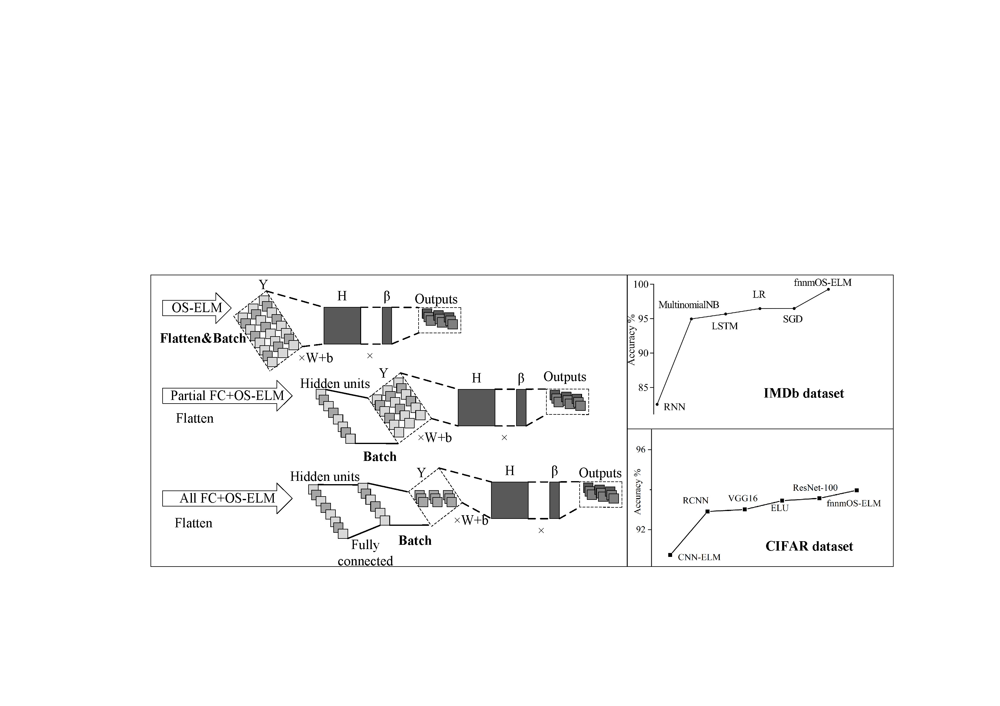

# fnnmOS-ELM

  

A Python implementation OS-ELM with CNNs or RNNs on some datasets.

## Requirements

* keras
* python >= 3.6


## Usage
  I have applied fnnmos-elm to many datasets, all of which have achieved good results. These datasets include iris, IMDB, cifar-10, cifar-100, MNIST and Boston. You can find the corresponding code in the corresponding directory. 

  In addition, fnnmos-elm needs to have a good pre training model, and I recommend that you use it as an optimizer, for the reasons that can refer to my paper.


## Citation
If you use any part of this code in your research, please cite our [paper](https://www.mdpi.com/531156):
```
@article{article,
author = {Li X, He S, Yu J, Wu L, Yue Z},
title = {FnnmOS-ELM: A Flexible Neural Network Mixed Online Sequential Elm},
journal = {Applied Sciences},
}
```
